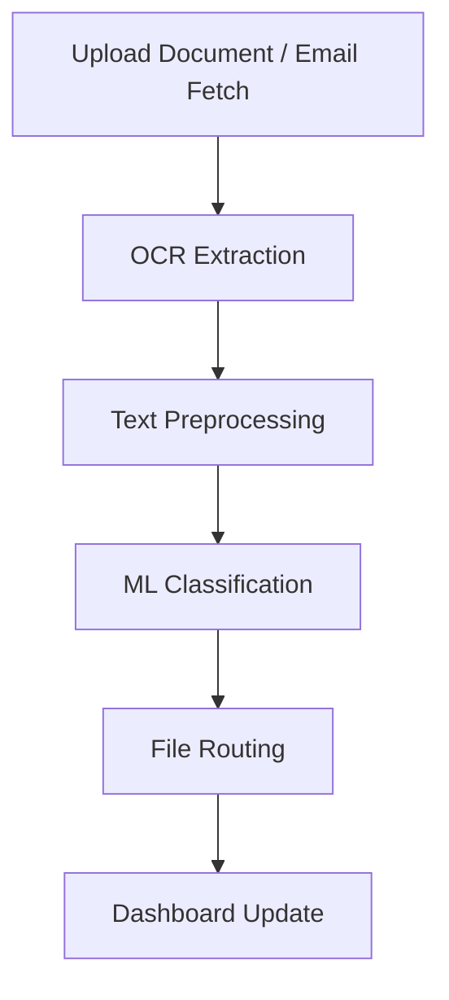

# DocuFlow AI

DocuFlow AI is a full-stack AI-powered system that automates the **ingestion, classification, and routing of documents**, with an intuitive dashboard for real-time tracking and analytics.

---

## Demo Video
🎥 [Watch the demo here](https://your-video-link.com)

---

## Features

- 📥 Drag-and-drop document upload
- 📧 Email ingestion (auto-fetches from Gmail)
- 🔍 OCR processing using Tesseract
- 🧠 Text preprocessing and ML-based classification
- 📂 Smart file routing to labeled folders
- 📊 Dashboard with real-time stats using Chart.js

---

## Tech Stack

| Layer      | Technology           |
|------------|----------------------|
| Backend    | Flask (Python)       |
| OCR        | Tesseract            |
| ML         | scikit-learn, TF-IDF |
| Preprocess | NLTK, regex          |
| Frontend   | HTML, JS, Bootstrap  |
| Charts     | Chart.js             |
| Email      | IMAP, email module   |

---

## Architecture Overview


##  How to Run

### Clone the repo
```bash
git clone https://github.com/yourusername/docuflow-ai.git
cd docuflow-ai
```
## Create a virtual environment
```bash
python -m venv venv
source venv/bin/activate  # On Windows use: venv\Scripts\activate
```

## Install dependencies
```bash
pip install -r requirements.txt
```

##Run the app
```bash
python app.py
```

##  Email Setup

- Enable **IMAP access** in your Gmail settings.  
- Generate a **Gmail App Password** and update it in `email_ingestion.py`.  
- The system will check for new attachments every **15 minutes** by default.

---

##  Dashboard Preview

-  **Live classification counts**
-  **Pie chart** of document types
-  **Pipeline progress** (Ingested → Extracted → Classified → Routed)

---

##  Deployment

-  Developed and tested locally using **VS Code**

---

##  Future Enhancements

-  LLM-based **entity extraction**
-  **Authentication and access control**
-  **Cloud storage integration** (AWS S3, Google Drive)

---

##  Authors

- **Kavya Ramesh**
- [Team Member 2]
- [Team Member 3]
- [Team Member 4]


